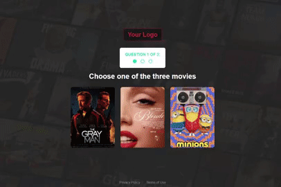

# Movie Picker

You'll be presented with a question and some movie options, when you click one of them, you'll see a new question, with new options. Eventually you'll be presented with a modal that redirects you to the IDBM website of the last picked movie.
This is a responsive app.

### Technologies used

I chose to use:

- [ReactJs](https://reactjs.org/)
- [React-CSS-Modules](https://github.com/gajus/react-css-modules)
- [Sass](https://sass-lang.com/)
- [GitHub](https://github.com/)

To ensure scalability and version control.

### Live deployment

Check the app [here](https://elisamunoz.github.io/movie-picker/)

### Run the code locally

`npm start` Runs the app in the development mode.\
Open [http://localhost:3000](http://localhost:3000) to view it in your browser.
